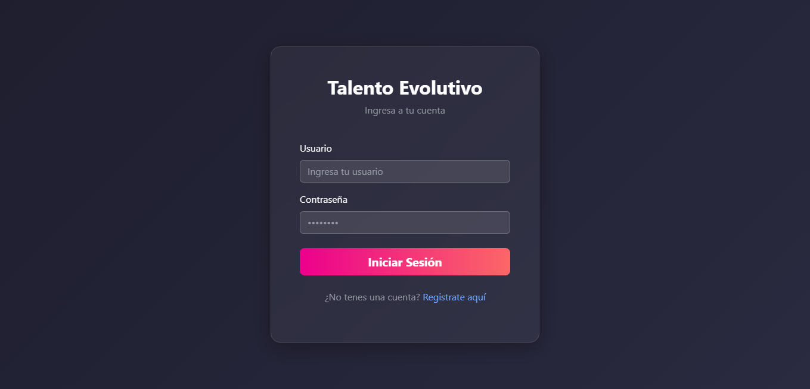
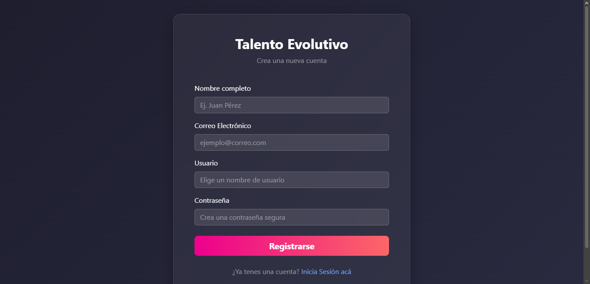
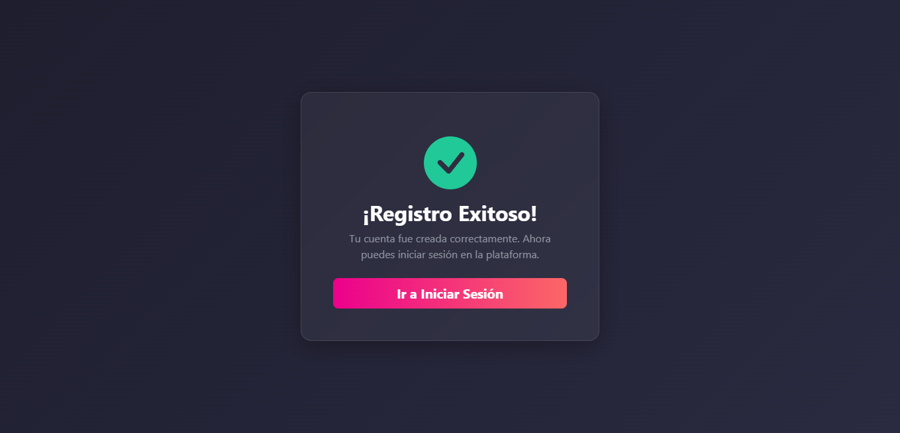
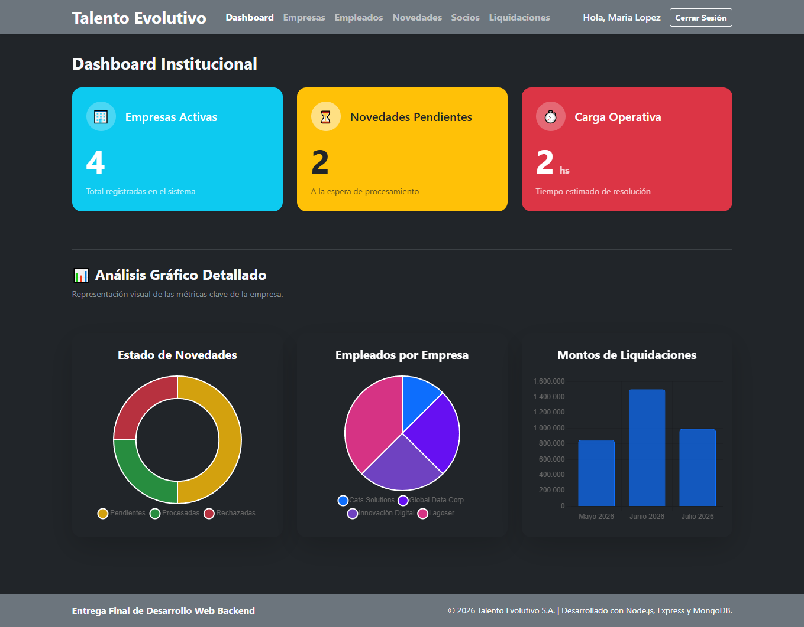
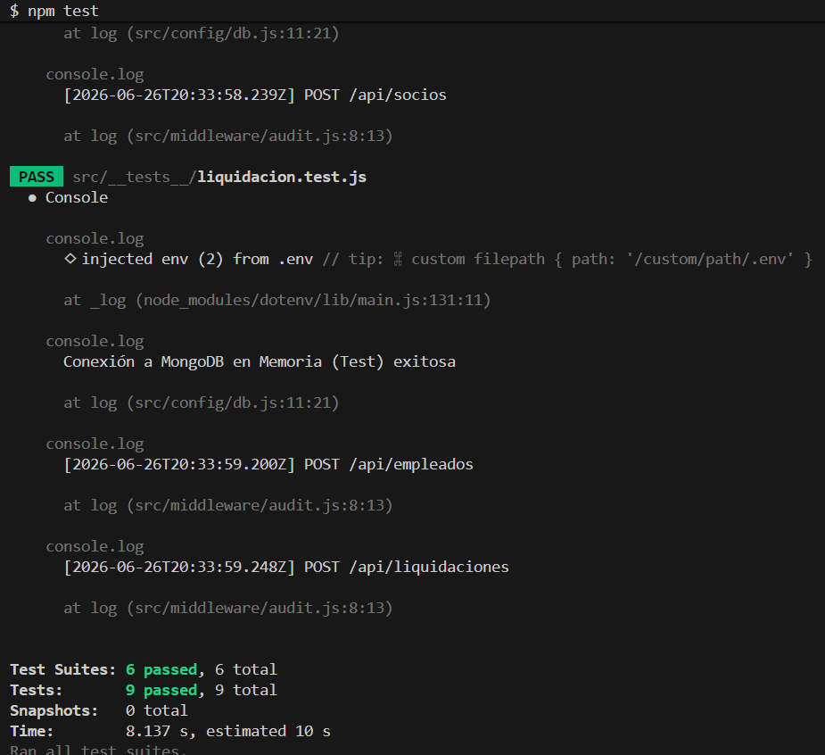

# Consultora HR "Talento Evolutivo S.A." - Matrix Devs 🚀

Este es un proyecto de desarrollo para la Consultora HR "Talento Evolutivo S.A.", llevado a cabo por el Grupo 6.

## 🛠️ Tecnologías Utilizadas

* **Backend:** Node.js, Express
* **Base de Datos & ODM:** MongoDB Atlas, Mongoose
* **Motor de Plantillas:** Pug
* **Frontend (UI):** Bootstrap 5, Chart.js
* **Seguridad & Sesiones:** JWT (JSON Web Tokens), Passport.js, bcrypt
* **Tiempo Real:** Socket.IO
* **Testing:** Jest, Supertest, MongoDB Memory Server

## 🚀 Instalación y Ejecución Local

Para probar o levantar este proyecto en un entorno local, sigue estos pasos:

1. **Clonar el repositorio:**
   ```bash
   git clone https://github.com/Matihp/Entrega_Final-Desarrollo_Web_BackEnd.git
   cd Entrega_Final-Desarrollo_Web_BackEnd
   ```

2. **Instalar las dependencias:**
   ```bash
   npm install
   ```

3. **Configurar las Variables de Entorno:**
   - Crea un archivo llamado `.env` en la raíz del proyecto.
   - Pega las siguientes variables y reemplaza la URI con tus credenciales de MongoDB Atlas:
     ```env
     PORT=3000
     SECRET=TuClaveSuperSecretaParaJWT123
     MONGODB_URI=mongodb+srv://<usuario>:<password>@cluster0.mongodb.net/NombreDB?retryWrites=true&w=majority
     ```

4. **Levantar el servidor:**
   ```bash
   npm start
   ```
   *La aplicación estará disponible en `http://localhost:3000`.*

5. **Correr los tests automatizados (Opcional):**
   ```bash
   npm test
   ```

## 📸 Evidencia Visual (Imágenes)

*Vista del formulario de inicio de sesión de la plataforma.*


*Pantalla para el registro de nuevos administradores y personal de HR.*


*Mensaje de confirmación al registrarse exitosamente en el sistema.*


*Dashboard principal que muestra los KPIs y gráficos en tiempo real.*


*Evidencia de la ejecución exitosa de los tests de integración en la terminal.*

## ⚙️ Características y Arquitectura

El proyecto utiliza el patrón **MVC (Modelo-Vista-Controlador)** con adiciones de seguridad y escalabilidad:

* **Base de Datos NoSQL:** Se utiliza MongoDB Atlas para almacenar la información de producción y `mongodb-memory-server` para levantar una base efímera y rápida al ejecutar el testing.
* **Modelos Estrictos:** Uso de esquemas de Mongoose con validaciones integradas para las entidades: `Empresa`, `Empleado`, `Novedad`, `Socio`, `Liquidación` y `User`.
* **Seguridad y Autenticación:** Se combina `Passport.js` para las sesiones de la interfaz web, con la generación y verificación de **JWT (JSON Web Tokens)** mediante middleware para proteger las operaciones de la API REST.
* **Testing de Integración (TDD):** Arquitectura refactorizada para permitir la ejecución programática de Tests de Integración que validan los endpoints CRUD y Auth sin impactar la base de datos real.
* **Dashboard Analítico:** Pantalla gerencial con tarjetas de estadísticas (KPIs) y representación gráfica (Doughnut, Pie, Bar charts) dinámica que lee en tiempo real de la base de datos.
* **Manejo Global de Errores:** Implementación de un middleware (`errorHandler`) para atrapar fallos asincrónicos, errores de validación de Mongoose, y devolver mensajes claros (`json`).

## 💼 Lógica de Negocio Aplicada: Integración del Ecosistema ATS (Ing. de Software)

Este repositorio ha sido extendido para funcionar como el módulo central de Nómina y RRHH, integrándose con la lógica de negocio de un Applicant Tracking System(ATS) externo. Las principales mejoras implementadas son:

* **Webhook de Integración y Reglas de Negocio:** Se desarrolló un endpoint REST (`/api/webhook/ats-contratacion`) diseñado para recibir los datos de candidatos aprobados desde el ATS. Incluye validaciones estrictas, como un **Filtro Anti-Duplicados** que verifica colisiones de DNI en la base de datos y validación lógica de longitud de CBU(22 dígitos).

* **Notificaciones en Tiempo Real (WebSockets):** Implementación de `Socket.io` junto a Express. Cuando el sistema procesa una nueva alta o cambia el estado de una Novedad, el Dashboard de Nómina recibe una alerta instantánea en vivo sin necesidad de recargar la vista del cliente.

* **Dashboard Gerencial Analítico:** Integración de la librería `Chart.js` en el motor de vistas. Transforma los datos crudos de Mongoose en métricas visuales interactivas, facilitando la toma de decisiones al visualizar los cuellos de botella en tiempo real.

## 📁 Estructura del Proyecto

```text
DSWB_2E_Grupo6_1C26/                     
├── assets/
├── src/
│   ├── __tests__/              # Pruebas de integración (Jest)
│   ├── config/                 
│   │   ├── db.js               # Conexión a MongoDB
│   │   └── passport.js         # Estrategias de autenticación web
│   ├── controllers/            
│   │   ├── AuthController.js
│   │   ├── DashboardController.js
│   │   ├── EmpleadoController.js
│   │   ├── EmpresaController.js
│   │   ├── LiquidacionController.js
│   │   ├── NovedadController.js
│   │   ├── SocioController.js
│   │   └── WebhookController.js
│   ├── middleware/             
│   │   ├── audit.js            # Registro de auditoría (logs)
│   │   ├── authJWT.js          # Verificación de tokens API
│   │   ├── authWeb.js          # Protección de vistas con sesión
│   │   ├── errorHandler.js     # Manejador global de errores
│   │   └── validator.js        # Validaciones genéricas
│   ├── models/                 
│   │   ├── Empleado.js
│   │   ├── Empresa.js
│   │   ├── Liquidacion.js
│   │   ├── Novedad.js
│   │   ├── Socio.js
│   │   └── User.js
│   ├── routes/                 
│   │   ├── authRoutes.js       # Rutas de autenticación API
│   │   ├── authWebRoutes.js    # Rutas de autenticación Web (Login/Register)
│   │   ├── dashboardRoutes.js
│   │   ├── empleadoRoutes.js
│   │   ├── empresaRoutes.js
│   │   ├── liquidacionRoutes.js
│   │   ├── novedadRoutes.js
│   │   ├── socioRoutes.js
│   │   ├── viewRoutes.js       # Renderizado de vistas MVC
│   │   └── webhookRoutes.js    # Integración con ATS
│   ├── views/                  
│   │   ├── empleados/          # Vistas CRUD de empleados
│   │   ├── empresas/           # Vistas CRUD de empresas
│   │   ├── liquidaciones/      # Vistas CRUD de liquidaciones
│   │   ├── novedades/          # Vistas CRUD de novedades
│   │   ├── socios/             # Vistas CRUD de socios
│   │   ├── dashboard.pug       # Vista principal (KPIs)
│   │   ├── layout.pug          # Plantilla base (Navbar/Estructura)
│   │   ├── login.pug           # Interfaz de inicio de sesión
│   │   ├── register.pug        # Interfaz de registro
│   │   └── register-success.pug# Vista de registro exitoso
│   └── app.js                  # Punto de entrada (Express & Socket.IO)
├── .env                        # Variables de entorno secretas
└── package.json                # Dependencias y scripts
```

## 👥 Integrantes y Responsabilidades (Grupo 6)

* **Matías Contreras:** Implementación integral de Integration Testing(Jest/Supertest) para las 6 entidades, refactorización de arquitectura de arranque para "Testability", diseño del Dashboard analítico (Pug + Chart.js) y mejoras generales de UI/UX.
* **María Lopez:** Diseño de las vistas de autenticación web (`login`, `register`, `register-success`) aplicando interfaces modernas, la configuración del flujo de sesiones, la implementación de un webhook para la integración del ATS y el sistema de WebSockets.

## 🤖 Uso de Herramientas de Inteligencia Artificial

Durante el desarrollo y documentación se utilizaron asistentes de Inteligencia Artificial (como Gemini/ChatGPT) con los siguientes propósitos:
* **Arquitectura y Testing:** Guia para la creacion de los archivos de testing e ideas para la conexión con el ecosistema de la materia Ingenieria de Software
* **Refactorización y redacción:** Apoyo en funciones asincrónicas, formato para la documentación técnica y la elaboración de este archivo README.md.

---
**Institución:** IFTS 29 | **Materia:** Desarrollo de Sistemas Web Backend (DSWB)